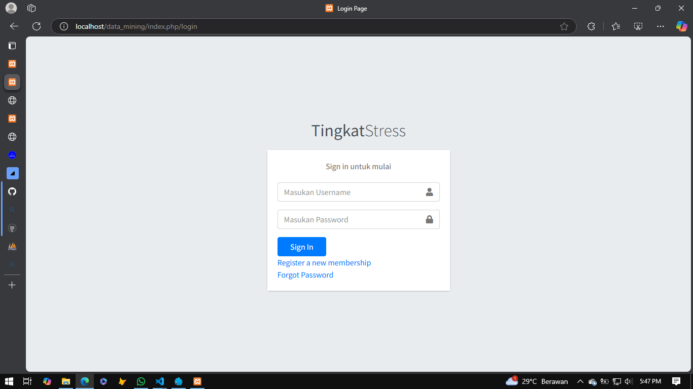
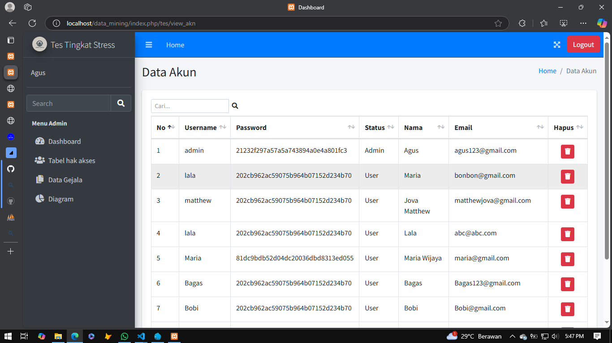
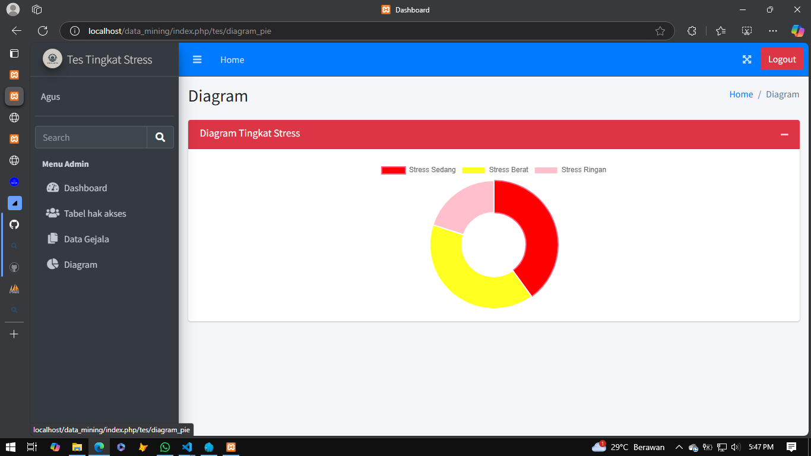
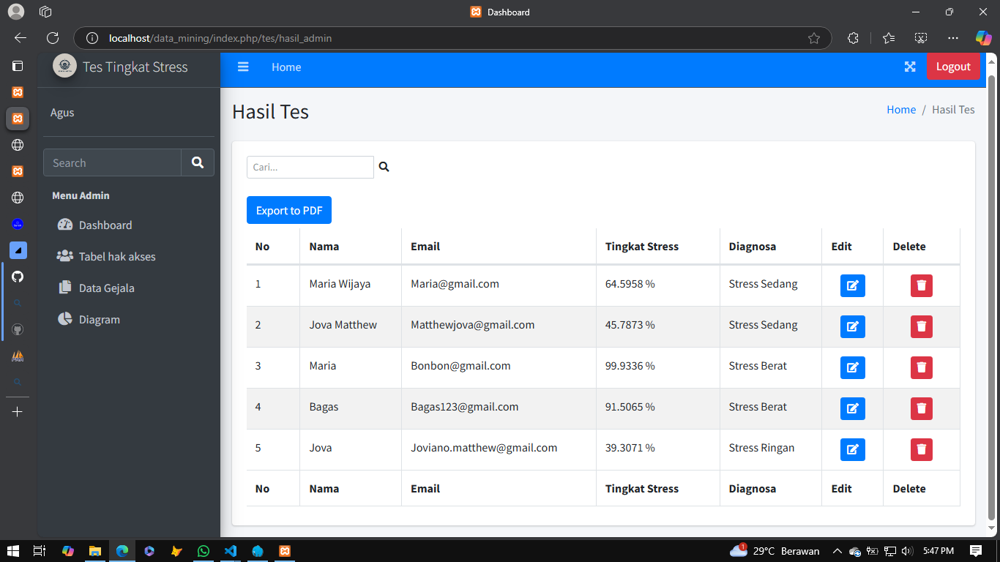
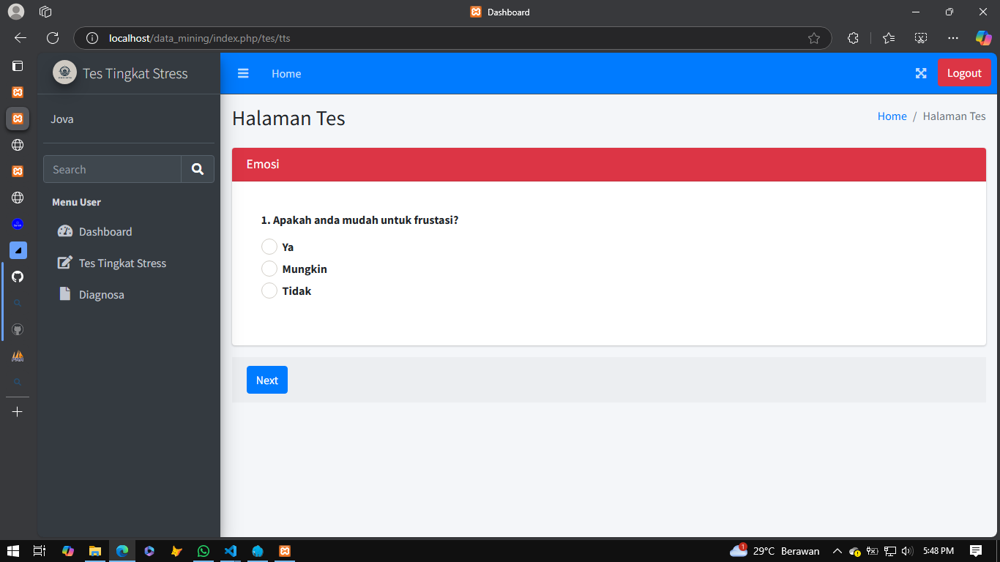
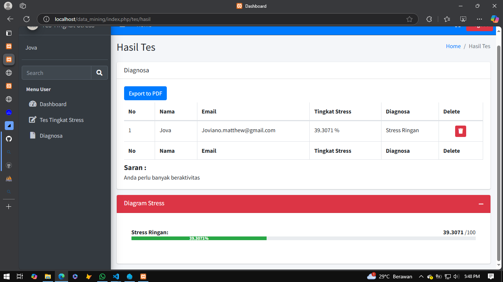

TTS atau Tes Tingkat Stress merupakan aplikasi web yang digunakan untuk menghasilkan tingkat stress manusia berdasarkan soal soal, TTS bekerja sama dengan dosen Psikologi untuk mendapatkan soal yang terbukti dalam dunia kesehatan mental. TTS menggunakan algoritma Certainty Factor untuk menghitung dan mengkalkulasi dari setiap jawaban yang diberikan.

tim:
- Oei Joviano M W
- Vic Jeremy P

Gambar:
- 
- 
- 
- 
- 
- 
